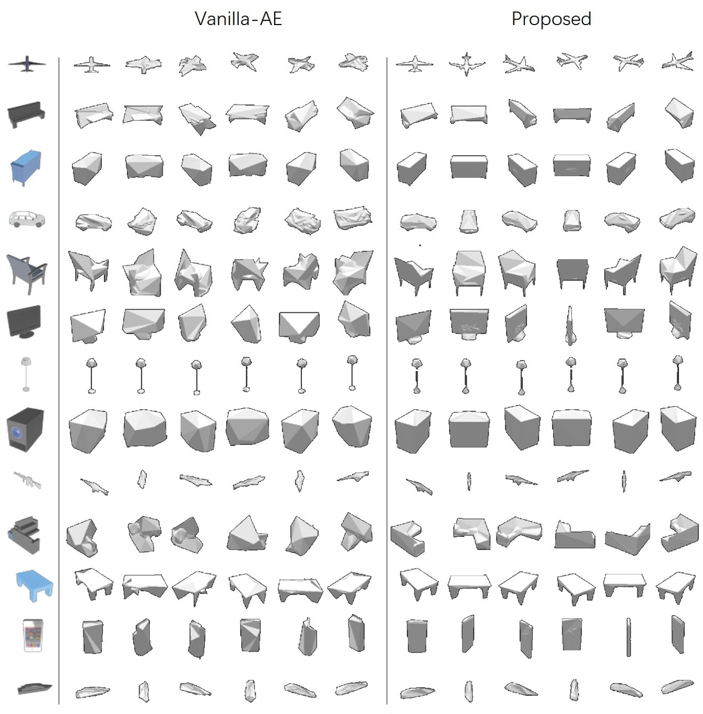

## Learn3D Introduction
This is the code repository for paper ["Learning Pose-invariant 3D Object Reconstruction from Single-view Images"](https://arxiv.org/abs/2004.01347)

Learning to reconstruct 3D shapes using 2D images is an active research topic, with benefits of not requiring expensive 3D data. However, most work in this direction requires multi-view images for each object instance as training supervision, which oftentimes does not apply in practice. In this paper, we relax the common multi-view assumption and explore a more challenging yet more realistic setup of learning 3D shape from only single-view images. The major difficulty lies in insufficient constraints that can be provided by single view images, which leads to the problem of pose entanglement in learned shape space. As a result, reconstructed shapes vary along input pose and have poor accuracy. We address this problem by taking a novel domain adaptation perspective, and propose an effective adversarial domain confusion method to learn pose-disentangled compact shape space. Experiments on single-view reconstruction show effectiveness in solving pose entanglement, and the proposed method achieves on-par reconstruction accuracy with state-of-the-art with higher efficiency.

The reconstruction result of proposed method is visulized in the following compared to vinilla AE method.

## Requirements

Python 3.x

Pytorch 0.4.x

[Neural_renderer Pytorch version](https://github.com/daniilidis-group/neural_renderer)(If its API is changed, please try an older version. Mine version of NR is 8e2078754ea572aa9bcf0c09eb6793421ad9c2db)

[visdom](https://github.com/facebookresearch/visdom)

## Dataset

We use the same dataset as Kato 18' (denoted as "CVPR18" in this code). To download the dataset, go to [mesh_reconstruction](https://github.com/hiroharu-kato/mesh_reconstruction) project and see *download_dataset.sh*

We also use another dataset from [here](https://github.com/akar43/lsm/blob/01edb3ce70a989207fd843bacf7693c057eb073e/shapenet.py#L13) (denoted as NIPS17 in code) to compare with the Kato 19' paper (VPL).

Another real-world dataset used is Pascal 3D+ obtained from Kato' 19 [here](https://github.com/hiroharu-kato/view_prior_learning).

## How to Run

* First, compile the CUDA voxelization code which converts mesh models to voxel models. This is for evaluation of reconstrction accuracy using voxel IoU. This CUDA code is borrowed from [here](https://github.com/hiroharu-kato/mesh_reconstruction/blob/master/mesh_reconstruction/voxelization.py). To compile, 

   `cd ./cuda`

  `python setup.py`

* To train, evaluate, reconstruct, t-SNE visualize ..., run *train.sh* and read the comments in "3D-GAN.py". More specifically:  
`python 3D-GAN.py --mode=train ...` for training our proposed model (denoted as "3D-AE-featGAN" in code). This can be trained on all three datasets (i.e. "CVPR18", "NIPS17" and "Pascal 3D+").  
`python 3D-GAN.py --mode=trainCVPR19` for training the compared CVPR19 method VPL. This can be trained on "CVPR18" dataset.  
`python 3D-GAN.py --mode=evaluation` evaluate reconstruction accuracy using voxel IoU   
`python 3D-GAN.py --mode=reconstruct` reconstruct sample images and save models for visulization   
`python 3D-GAN.py --mode=t_SNE` t_SNE visualization of learned shape embedings  
`python 3D-GAN.py --mode=interpolation` shape space interpolation visualization  
`python 3D-GAN.py --mode=MMD` caculate MMD distance of shape embeddings in different domains/poses

## Terms of Use
This code and its derived model is only for non-profit acdemic research purposes.

## Citation
If you find this code usful, please cite our paper as 

@misc{peng2020learning,  
    title={Learning Pose-invariant 3D Object Reconstruction from Single-view Images},  
    author={Bo Peng and Wei Wang and Jing Dong and Tieniu Tan},  
    year={2020},  
    eprint={2004.01347},  
    archivePrefix={arXiv},  
    primaryClass={cs.CV}  
}
 
